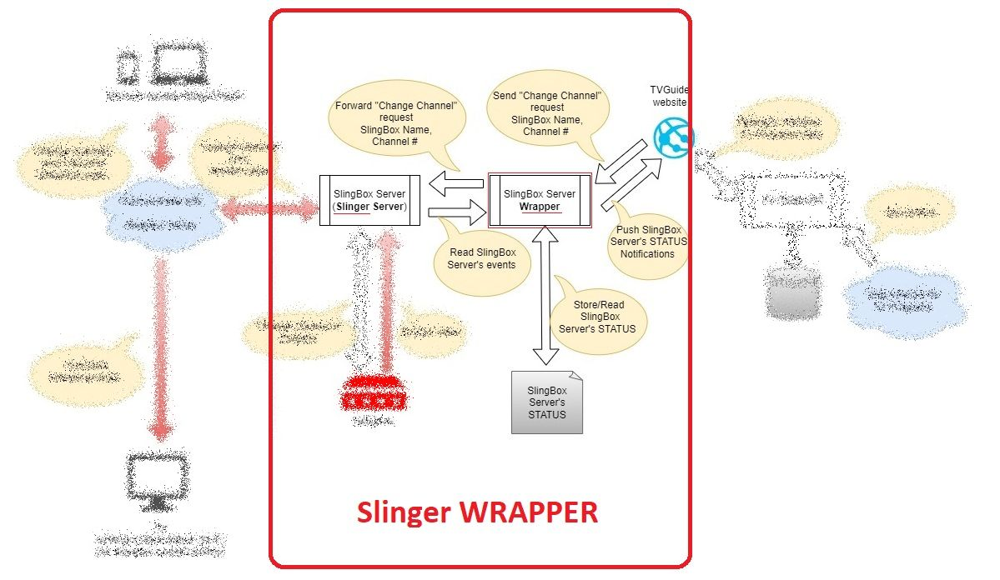

# SlingBox Channel-Changer Server

This is a **wrapper** around the [Slinger Server](https://github.com/GerryDazoo/Slinger/tree/main/CustomRemotes) which allows **channel-changing** capabilities when controlled by the [SlingBox-TV Guide](https://github.com/bradut/SlingBox-TVGuide) web app.

In this sense, a **wrapper** app enhances or extends the capabilities of an existing application by providing additional features or functionalities.


## Table of Contents

- [Overview](#overview)
- [System Architecture](#system-architecture)
- [How it works?](#how-it-works)
- [Installation](#installation)
- [Configuration](#configuration)
- [Contributing](#contributing)
- [License](#license)
- [Credits](#credits)
- [Disclaimer](#disclaimer)


## Overview

The **Sling Server Wrapper** (the wrapper) extends the Slinger server by:

- circumventing Slinger's [CORS](https://en.wikipedia.org/wiki/Cross-origin_resource_sharing) policy and accepting channel-changing request from the [SlingBox-TV Guide](https://github.com/bradut/SlingBox-TVGuide) app located anywhere on internet.
- preserving the state of the server between requests, allowing users to see the **currently selected channel**  of their Slingbox devices. (This functionaliy was available in the original SlingPlayer&trade; application.)
<br />

**Naming convention**: the terms "Sling Server Wrapper", "Slinger Server Wrapper", "wrapper" and various combinations are used interchangeably in this document.

**Notes**:

- The "**Wrapper**" is not a replacement for Slinger; it is an extension of it, and it requires Slinger to be installed and running on the same machine.
- Using the "**Wrapper**" does not interfere with Slinger setup and usage; it can be used in parallel with it by the users who want to use the **SlingBox-TV Guide** enhanced remote control mentioned above.<br />
<br />

## System Architecture

<p align="center">
<br />
System Architecture - Slingboxes, Slinger Server, Slinger Server Wrapper, TV Guide Web App, TV Guide Data Source
</p>
<br />

This wrapper is a part of a wider system, as shown in the above diagram.

The system consists of:

- **Slingbox Devices**: The devices controlled by the system.
- **Slinger Server**: The server that communicates with the Slingbox devices and provides the API for controlling them.
- **Slinger Server Wrapper**: This wrapper, extending the Slinger Server with the capabilities described above.
- **TV Guide Web App**: A web application providing a TV Guide for Slingbox devices and a remote control for them.
- **TV Guide Data Source**: A data source for the TV Guide Web App providing the TV Guide data.
<br /><br />

Where to get these components?

- **Slingbox devices**: Discontinued by Sling Media, available on the second-hand market.
- **Slinger Server**: Open-source app created by Gerry Dazoo, downlodable from its [GitHub repo](https://github.com/GerryDazoo/Slinger).
- **Sling Wrapper**: Open-source app created by Bradut Dima, downloadable from this GitHub repo.
- **TV Guide Web App**: Open-source app created by Bradut Dima, downloadable from its [GitHub repo](https://github.com/bradut/SlingBox-TVGuide)
- **TV Guide Data Source** To be created by the user, hosted anywhere on the Internet. Specific instructions provided in the TV Guide Web app repo.

## How it works?

### Slinger Server Functionality

<p align="center">
<br />
System Architecture - Slinger Server
</p>

The functionality of the Slinger Server is documented in its own GitHub repo.<br />
The simplified diagram above shows the main components of the Slinger Server and how they interact with each other.<br />
It can be seen that even when integrated with the wrapper, the **Slinger Server functions as a standalone application** that does not require any other components to be installed on the same machine.

### Slinger Server WRAPPER Functionality

<p align="center">
<br />
System Architecture - Slinger Server and Slinger Server Wrapper
</p>

The Slinger Server Wrapper is a .NET Core application running on the same machine (same folder actually) as the Slinger Server.<br />
It is a wrapper around the Slinger Server, providing the following functionality:

- Starts the Slinger Server
- Reads the configuration of the Slinger Server (from `config.ini` or `unified_config.ini`) and uses it to configure itself.  
- Reads the console output of the Slinger Server to identify the **events** generated by it, and uses these events to update the state of the wrapper.
These events are:<br />
  - Streamming in progress
  - Streamming stopped
  - Channel changed
  - Slingbox bricked
  - Remote control locked
- Communicates with the channel-changer SlingBox-TV Guide website to notify about any event and to provide the current wrapper state, so that the UI can indicate the selected channel or display info about server events.
- accepts change-channel requests from the SlingBox-TV Guide website, and uses them to control the Slinger Server.
<br />
<br />

## Installation

The Sling Server Wrapper is provided as a single Windows-executable file named RunSlingServer.exe that can be downloaded from this repo.<br />
(Mac and Linux users could probably generate an OS-specific executable, but this has not been tested.)

- It doesn't need to be installed,
- It only needs to be run from the same folder on the machine where the Slinger Server is installed.

To run the Sling Server Wrapper, download the following items **on the same folder where the Slinger Server is installed**:

1. The Sling Server Wrapper executable file - from the [Download](./Docs/Download/RunSlingServer.exe?raw=true) page of this repo,
2. The `js` directory - from this repo,
3. The `HTML` files for the remote controls - from this repo.

Notes: the `js` folder and the `HTMLS` remote control files are optional, but **very helpful** when using the wrapper, because:

- They can read the the wrapper's status from file `SlingBoxStatus.json`, and use that info to assign a URL reference to the "TV Guide" button of the remote-control page, so that it can launch the channel-changer TV Guide app<br /> 
(Otherwise you will need to hard-code this in your remote control page),
- They display the current slingbox name (useful when multiple slingboxes are controlled by the same wrapper and same remote control form)
- Allow implementing other possible features, such as displaying the current channel in the remote-control page.

Probably, in the future, accessing the server status will be delegated to querying the Wrapper instead of reading this file.

Once the above files are downloaded, you can run the Sling Server Wrapper by double-clicking on the RunSlingServer.exe file [Run as Administrator].

At FIRST RUN, the wrapper will:

- Create a configuration file named `appsettings.json` in the same folder where it is located. Initiually, this file contains default settings, among them being Slinger's configuration file: `config.ini`. You may change later these settings as explained below.
- Read the Slinger configuration file from `appsettings.json`, which initially is `config.ini`.
- Read from `config.ini`:
 	- The list of slingboxes, with their names, types and VideoSources
  - Slinger's urlBase and port number
- Generate the file **`SlingBoxStatus.json`** based on the actions above  
<br />

Afer the first run, your Slinger folder will look like this:
<p align="center">
<br />
Slinger Wrapper Components: JS, HTML files, RunSlingServer.exe, etc. 
</p>
<br />
<br />

## Configuration

**Prerequisites**: 

- You will need to **create a TV Guide web site** somewhere on your local machine or on the Internet.
- You need to have a functional Slinger server, on a Windows machine.

For demo purposes, I created two TV Guides apps on my server:<br />
<http://tvGuideAnalogue.dima.mobi/TvGuide.html><br />
<http://tvGuideDigital.dima.mobi/TvGuide.html><br />
[They **will NOT work for you** because they are configured to work with my Slingbox devices, but you can use them as examples.]

As explained, once you run the Sling Server Wrapper for the first time, it will create the files `appsettings.json` and `SlingBoxStatus.json` with **default** settings.<br />
You will then need to modify `appsettings.json` and maybe `config.ini` in order to work with your particular Slinger Server configuration.

### Update config.ini

**IMPORTANT** The Wrapper **works only with the `unified_config.ini` STRUCTURE** !<br />
The name of the config file is irrelevant as long as you copy and paste the body of `unified_confi.ini` into it.
<br />
<br />

**Naming convention**: in this document will use the term **`config.ini`** to refer to Slinger config file, regardless of the name you use it on your machine.

In the following example, we see a configuration file with the **unified_config.ini format** that contains the list of slingboxes and the server info.<br /> 

```ini
; This a unified config.ini for three slingboxes

[SLINGBOXES]
sb1=sling_1
sb2=sling_2
sb3=sling_3

[sling_1]
sbtype="Solo/Pro/ProHD"
password=admin1    
ipaddress=192.168.1.254

port=5001

;valid range = 0..16 
Resolution=12

;Valid Values 1, 6, 10, 15, 20, 30, 60   depending on resolution
FrameRate=25

;Min 50 Max 8000
VideoBandwidth=8000

;Min 0 (auto) max 63
VideoSmoothness=63

;--------------------------------------------------------
;ProHD:   0=Tuner  1=Composite   2=S-Video   3=Component
;--------------------------------------------------------
VideoSource=1
StartChannel=800   
;RemoteLock=yes
tvGuideUrl=http://192.168.1.10/TvGuideDigitalCanada/TvGuide.html  ;<-- When using a specific TV Guide 
Remote=remote_Digital.html


[sling_2]
sbtype="Solo/Pro/ProHD"
password=admin2   
ipaddress=sling2.domain.com

port=5002
Resolution=12
FrameRate=25
VideoBandwidth=2500
VideoSmoothness=63
VideoSource=0
;RemoteLock=yes
Remote=remote_Analogue_ProHD.html

[sling_3]
sbtype="Solo/Pro/ProHD"
password=admin3   
ipaddress=sling2.domain.com

port=5003
Resolution=12
FrameRate=25
VideoBandwidth=2500
VideoSmoothness=63
VideoSource=0
;StartChannel=0.                            <-- Doesn't work with Analog Tuner
Remote=remote_Analogue_ProHD.html


[SERVER]
port=54321
maxremotestreams=5
URLbase=myslings
enableremote=yes
```

Make these changes in `config.ini`  

- Update the name of the remote control files as `remote_Digital.html` and/or `remote_Analogue_ProHD.html`
  - `remote_Analogue_ProHD.html` is an adaptation from `\CustomRemotes\ProHD_Tuner.txt` for use with analog video-sources and automatically adds a dot to the channel number, as indicated in Slinger documentation for analogue tunners.
  - `remote_Digital.html` is an adaptation from `remotes.txt`, where the number buttons have been removed.<br />

- If you want to continue using your current remote controls, you may consider adding a "TV Guide " button, adding a reference to the JS folder and include a few HTML elements in their pages:
  - (Keep using your remote) Add reference to JS foler

```js
    <script src="/js/slingerplayer.js"></script>
```

-
  - (Keep using your remote) Include the ID `titleElem` in the title element to be populated automatically with your slingbox name:

```html
  <h2 id="titleElem" class="title" >
      
  </h2>
```

-
  - (Keep using your remote) Include an element contaning "`Status:%s`" string, which will trigger Slinger Server to replace it with its status.<br />
  This element will help SlingBox - TV Guide to know immediately when the slingbox has stopped streaming, otherwise will have to wait for 100 seconds of server inactivity.

```html
  <div id="slingStatus" style="color: Transparent; font-size: 1px">
      <!--DO NOT REMOVE: MAGIC string replaced by Slinger with server status.-->
      <label>Status:</label>Status:%s
  </div>
```


<br />
<br />

- (Optional) In case some of your slingboxes require a specific TV Guide page, different from the rest, then add the entry 'tvGuidUrl':

```ini
tvGuideUrl=http://192.168.1.10/TvGuideDigitalCanada/TvGuide.html    ;<-- Add this if needed
```

### Update appsettings.json

After the first run, stop the Wrapper to make a few changes in `appsettings.json`<br />

The settings in this file are used by the wrapper to configure itself and to communicate with the Slinger Server and the TvGuide web app.<br />
Some of these settings are committed automatically by the wrapper into the `SlingBoxStatus.json` file.<br />  

This is the default `appsettings.json` configuration file generated by the wrapper at first run:

```json
{
  "AppSettings": {
    "Version": "1.0.0",
    "SlingboxServer": {
      "ExecutableName": "slingbox_server.exe",
      "Arguments": [
          "config.ini"
      ]
    },
    "TvGuide": {
      "TvGuideUrl": "http://localhost:80/TvGuideWebSite/TvGuide.html",
      "SlingRemoteControlUrl": "http://localhost:5196/api/post-to-url"
    },
    "RemoteControlIrCodes": {
      "Ch+": "4",
      "Ch-": "5",
      "Last": "56"
    }
  },
  "Logging": {
    "LogLevel": {
      "Default": "Information",
      "Microsoft.AspNetCore": "Warning"
    },
    "LogFilePath": "logs/log-channel-change-{Date}.txt"
  },
  "AllowedHosts": "*",
  "Kestrel": {
    "Endpoints": {
      "Http": {
        "Url": "http://localhost:5196"
      }
    }
  }
}
```

#### Update AppSettings.SlingboxServer section

```json
 "SlingboxServer": {
   "ExecutableName": "slingbox_server.exe",
   "Arguments": [
      "config.ini"
   ]
 },
```

- Update the name of the config file passed to Slinger if it is different from **`config.ini`** (example: you may write `unified_config.ini` instead).  

#### Update AppSettings.TvGuide section

```json
 "TvGuide": {
   "TvGuideUrl": "http://localhost:80/TvGuideWebSite/TvGuide.html",
   "SlingRemoteControlUrl": "http://localhost:5196/api/post-to-url"
 },
```

- Update the URL of the TV Guide web app to match your own.<br />
`TvGuideUrl` is the URL that will be used by the wrapper to communicate with the TV Guide web app to send/receive channel-change requests<br />
If you haven't configure  a TV Guide web app web page, you may use <http://tvGuideAnalogue.dima.mobi/TvGuide.html> for demo purposes<br />
(note: this **will not work for you**, but it's helpful to see how it can be integrated with the wrapper via a remote-control page)<br />
If you have multiple slingboxes, the wrapper will, by default, use this TV Guide URL for all of them, but this can be overriden for each slingbox, as described above, in the **Update `config.ini`** paragraph.

- `SlingRemoteControlUrl` is the URL that points to the location of the Sling Wrapper.<br /> 
Update it if it is different from the one in the example above.<br />
Normally, this should be the same as the Slinger URL, except for the port number.<br />
If you want to modify the port number, you will need to also update it in the Kestrel configuration section in this file file accordingly.

**IMPORTANT**: When using the TV Guide from a different computer or a mobile device within your local network or on the Internet::

1. Ensure the URLs above **do not** reference `localhost` (as this only works within your computer).
2. Confirm that the URL in `SlingRemoteControlUrl` can be accessed from the URL in `TvGuideUrl`, and vice versa.

This ensures bidirectional communication between your Wrapper and the TV Guide app.
<br />
<br />

#### Update the AppSettings.RemoteControlIrCodes section (Remote Control IR Codes)

```json
 "RemoteControlIrCodes": {
   "Ch+": "4",
   "Ch-": "5",
   "Last": "56"
 }
```

Update the IR Codes for the remote control buttons if you use a digital streaming source and your PVR uses differents codes.<br />
For example, the "Last" button which is used to display the last channel, is mapped to the IR code `56` by default, but may have different value on your configuration, or may not be active at all.<br />
If is not active, assign it the value "`-999`" to disable it.

Please note that some of the channel-changing buttons in the complex remote controls defined in the Slinger project are **not** interpreted by the Wrapper in the current version:

- Channel numbers: 0...9
- Arrow Up / Down
- Arrow Left / Right
- Page Up /Down
- ...etc.

Therefore, using these buttons may de-synchronize the Slinger and the Wrapper, resulting on TV Guide displaying different channels as selected.

#### Update Kestrel section

````json
  "Kestrel": {
    "Endpoints": {
      "Http": {
        "Url": "http://localhost:5196"
      }
    }
  }
````

The wrapper is a Web API application, and it uses the Kestrel web server to listen for requests.<br />
In this section you can update the port number used by the wrapper.

If you want to use HTTPS, you will need to update the configuration accordingly and you will need to provide a certificate for the wrapper.<br />
Avoid using HTTPS if your TV Guide web app is not also using HTTPS because some browsers will block the requests from the Wrapper to the web app.<br /> 
(may work with Chrome, but not with Firefox)

Here is an example of the the config file with an `HTTPS` endpoint:

```json
  "Kestrel": {
    "Endpoints": {
      "Http": {
        "Url": "http://localhost:5196"
      },
     "Https": {
        "Url": "https://localhost:7064"
      }
    }
  },
  
````

#### Update Logging section

```json
"Logging": {
   "LogLevel": {
     "Default": "Information",
     "Microsoft.AspNetCore": "Warning"
   },
   "LogFilePath": "logs/log-channel-change-{Date}.txt"
 },
```

This section tells the Wrapper to log its activity in the file specified in the "LogFilePath" property.<br />
You can update the path and the name of the log file if you want to.<br />
(Logging to file functionality is currrently broken, will fix it sometime)

### About SlingBoxStatus.json

This file stores a simplified form of the `server status`- it contains only values relevant to SlingBox - TV Guide channel changer app.<br />
It has been created by the Wrapper at first run with information gathered from `config.ini` and `appsettings.json` and will be updated by the Wrapper whenever it detects an event while reading the Slinger's console.<br />
`Note: Do not modify this file !` <br />

```json
{
  "slingBoxes": {
    "sling_1": {
      "slingBoxId": "sb1",
      "currentChannelNumber": -1,
      "lastChannelNumber": -1,
      "isAnalogue": false,
      "lastHeartBeatTimeStamp": null,
      "tvGuideUrl": "http://192.168.1.10/TvGuideDigitalCanada/TvGuide.html" <-- from config.ini
    },
    "sling_2": {
      "slingBoxId": "sb2",
      "currentChannelNumber": -1,
      "lastChannelNumber": -1,
      "isAnalogue": true,
      "lastHeartBeatTimeStamp": null
    },
    "sling_3": {
      "slingBoxId": "sb3",
      "currentChannelNumber": -1,
      "lastChannelNumber": -1,
      "isAnalogue": true,
      "lastHeartBeatTimeStamp": null
    }
  },
  "urlBase": "myslings",
  "tvGuideUrl": "http://192.168.1.10/TvGuideWebSite/TvGuide.html",  <-- from appsetting.json
  "slingRemoteControlServiceUrl": "http://localhost:5196/api/post-to-url" <-- from appsetting.json
}
```

The file above stores a snapshot of the **`status of the wrapper server`** which contains:

- The three slingboxes defined in `config.ini`: "`sling_1`", "`sling_2`" and "`sling_3`"
- The settings of each slingbox:
  - `slingBoxId`: The ID declared in `config.ini`.
  - `currentChannelNumber`: The number of the channel that is being streamed by the slingbox.<br />
    The value `-1` indicates that the slingbox has not streamed yet since the creation of the file `SlingBoxStatus.json`
   
  - `lastChannelNumber`:  The number of the previously streamed channel.<br />
    It is used by the wrapper to switch to this channel when the "Last" button has been pressed/clicked/touched on the remote control page.<br />
    Tested succesfully with analogue video-sources but had issues with a digital one where, instead of last channel, the PVR displays a selection of the last 5 channels to select from.  
    
  - `isAnalogue`: (true or false) = The type of video-sources, identified by the wrapper based on the Slinger documentation.<br />
    For example, a video-source is considered analogue for slingboxes of type "**Pro**" or "**ProHD**" when **VideoSource = 0**.<br />
    Furthermore, this setting is used by the wrapper to identify the channel-changing info when reading Slinger's console output and sending commands to the TV Guide.<br />
     
  - `lastHeartBeatTimeStamp`: The last time when the wrapper has detected Slinger console output for a specific slingBox device.<br />
     This setting let TV Guide know if a certain slingBox is still streaming or not, so that it can adjust its UI accordingly (change the aspect of the channel buttons on the web page, etc.).<br /> 
     The wrapper will automatically change this value to `null` if it is older than 100 seconds, based on the fact that, every 90 second, Slinger display on its console information about each of its slinboxess that are currently streaming.<br />
     The values of this setting can be either `null` or the date-time of the last event in the format `"2023-12-07T18:54:05"`.

  - `tvGuideUrl`: This is an OPTIONAL setting to indicate that the TV Guide URL for a certain slingBox is different than the server-wide TV Guide URL.<br />
    For example, above is a configuration where **slingbox_1**, having a **digital** video-source, uses the TV Guide with the URL `http://192.168.1.10/TvGuideDigitalCanada/TvGuide.html` instead if the server-wide TV Guide for analogue channels `http://192.168.1.10/TvGuideWebSite/TvGuide.html` defined below for all other slingboxes.

- The server-wide settings in SlingBoxStatus.json are:
  - `urlBase`: From `config.ini` - see Slinger's documentation.
  - `tvGuideUrl`: From `appsettings.config`, this is the URL of the channel-changer SlingBox-TV Guide.<br />
  Unless it is overrriden at SlingBox level as shown above for `sling_1`, this URL will be used by the the remote control of each slingbox to open the TV Guide page.

  - `slingRemoteControlServiceUrl`: From `appsettings.config`, this is the URL of the Slinger Wrapper.<br />
  It will be passsed to the TV Guide so that it wiil be able to communicate back with the Wrapper.<br />
<br />

**Summary**: The server status values in the file `SlingBoxStatus.json` are automatically synchronized with:

- Settings from configuration files `config.ini` and `appsetting.json` 
- Events resulted from reading Slinger's console output<br />

Therefore, any modifications should be made in these configuration files and **NOT** in `SlingBoxStatus.json`.<br />
Otherwise, the changes will be overridden..
<br />
<br />

# Contributing
Contributions are welcome!<br />

If you want to contribute, please contact me first to discuss the changes.

This is a .NET Core 7 app compiled as a standalone, self-contained executable. Therefore, it does not require .NET to be installed on users' computers.

It cannot be upgraded to .NET Core 8 because the new framework does not allow creating such executables capable of communicating with SignalR (as of December 2023).

This app originated from two separate projects - one serving as a pass-through for post requests from TV Guide to Slinger, and the other as a Slinger console reader.<br /> 
After successfully mediating communications between Slinger and TV Guide, these projects were merged into the current one, resulting in certain architectural irregularities.

This is a personal project, and I don't have a lot of time to work on it.
<br />
<br />

# License
This project is licensed under the MIT License - see the [LICENSE](./Docs/License.md) file for details
<br />
<br />

# Credits
- [Slingbox by Sling Media](https://en.wikipedia.org/wiki/Slingbox) - the device that streams TV channels over the Internet<br />
"Slingbox" is a trademarked term associated with products and services provided by Sling Media, 
a subsidiary of DISH Network Corporation.<br />
The Slingbox is a line of devices that allow users to remotely view and control their cable 
or satellite television.
 - [Slinger Server](https://github.com/GerryDazoo/Slinger) - open source server that controls the SlingBoxes, created by **Gerry Dazoo**
- [Slinger Player](https://github.com/GerryDazoo/SlingerPlayer) - video player that streams from the Slinger, created by **Gerry Dazoo**
- [SlingBox Channel-Changer TvGuide](https://github.com/bradut/SlingBox-Channel-Changer-TVGuide) - TV Guide with channel-change capability, created by **Bradut Dima** 
- **AI Assistants** - used to generate code, documentation and proofreading.
  - [OpenAI ChatGPT3](https://chat.openai.com/)
  - [JetBrains AI Assistant](https://www.jetbrains.com/ai/)
  - [Microsoft GitHub Copilot](https://code.visualstudio.com/blogs/2023/03/30/vscode-copilot)
- [Draw.io](https://app.diagrams.net/) - used to create diagrams
<br />
<br />

# Disclaimer

All trademarks, logos and brand names are the property of their respective owners.<br /> 
All company, product and service names used in this app and documentation are for identification purposes only.
